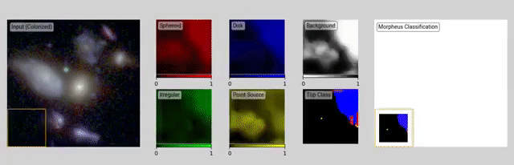

.. image:: https://travis-ci.com/morpheus-project/morpheus-core.svg?branch=master
    :target: https://app.travis-ci.com/morpheus-project/morpheus-core.svg

.. image:: https://codecov.io/gh/morpheus-project/morpheus-core/branch/master/graph/badge.svg
    :target: https://codecov.io/gh/morpheus-project/morpheus-core

.. image:: https://readthedocs.org/projects/morpheus-framework/badge/?version=latest
    :target: https://morpheus-framework.readthedocs.io

.. image:: https://img.shields.io/badge/code%20style-black-000000.svg
    :target: https://github.com/ambv/black

.. image:: https://img.shields.io/badge/python-3.6-blue.svg
    :target: https://www.python.org/downloads/release/python-360/

``morpheus_core`` is python package that scales up per-pixel machine
learning methods to large astronomical images. It is designed to take an already
trained per-pixel machine learning/deep learning model and scale it up to large
astronomical images. ``morpheus_core`` handles the following tasks:

- Opening large FITS files
- Extracting the batches of image subsamples
- Feeding the batches to the provided model
- Aggregates output classifications into large output FITS image
- Parallelize classification using CPUs or NVIDIA GPUs

``morpheus_core`` does this by using a 'sliding window' technique. Extracting a
moving window of a large image feeding to your model, and aggregating the
outputs from your model back into an output image that is the same size as the
input image(s).An example of this aggregation can be seen below, as applied in
the original `Morpheus <https://morpheus-project.github.io/morpheus/>`_ paper:

``morpheus_core`` offers two methods for aggregating outputs on pixels:
calculating a running mean and variance, and a 'rank vote' method. The mean
and variance outputs are recorded for each output class. The 'rank vote' method
records which of the output classes has the highest value and keeps a 'running
tally' of how many times an output class has the highest value and normnalizes
the counts to sum one when ``morpheus_core`` is finished classifying the
image.

Installation
============

Requirements:

- ``astropy``
- ``dill``
- ``numpy``
- ``tqdm``

.. code-block:: bash

    pip install morpheus-core

Usuage
======

Setup
-----

To use ``morpheus_core`` to apply your model to astronomical images you
need to provide ``morpheus_core`` with your model in the form of a
``Callable`` function and the inputs arrays in the form of a list of ``numpy``
arrays or a list of strings that are the file locations of the ``fits`` files
that are inputs.

.. code-block:: python

    from morpheus_core import morpheus_core

    n_classes = 5             # number of classes that are output from the model
    batch_size = 16           # number of samples to extract per batch
    window_shape = (100, 100) # (height, width) of each sample

    output_hduls, output_arrays = morpheus_core.predict(
        model,        # your model in a callable from
        model_inputs, # list of numpy arrays or strings that point to fits files
        n_classes,
        batch_size,
        window_shape
    )

``output_hduls`` is a list of ``astropy.io.fits.HDUList`` objects that
correspond to the ``output_arrays`` if ``model_inputs`` are strings. If
``model_inputs`` are ``numpy`` arrays then this is an empty list.
``output_arrays`` is a list containing the ``morpheus_core`` aggregated
classifications and the ``n`` array indicating how many times each pixel in the
image was classified by the ``model``.

Output Format
-------------

``morpheus_core`` can aggregate multiple outputs for single pixels in one
of two ways. The first is by recording the mean and the variance for predictions
for each class in each pixel. This is stored by adding an extra dimenion in the
output array. For example, if the input array has a shape of ``[1000, 1000, 1]``
and ``n_classes=3`` then the output array will have the shape
``[1000, 1000, 3, 2]`` where the 3rd dimenion is the number of classes and the
last dimension are the mean and the variance in that order. The other method
for aggregating outputs is by a "rank vote" method. Which keeps a running tally
of how many times a class was the top classification and then divides by ``n``.
The output shape for the rank vote aggregation for the same input array
would be ``[1000, 1000, 3]``.

Parallelization
---------------

``morpheus_core`` supports the parallel classification of large images by
splitting the input along the first dimension (height typically), classifying
each piece in parallel, and then combining the resulting classifications into a
single classified image. You can parallelize over GPUS or CPUS, both methods
require that the ``out_dir`` be provided so that ``morpheus_core`` knows
where to save the subsets of the images and their classifications. Further your
model gets saved into each subdirectory via ``dill`` and so ``model`` must be
a ``dill``-pickleable function.

GPUs
****

To parallelize the classification of a large image over multiple GPUs, the
``gpus`` argument must be provided and should be a list of the integer GPU ids
for the GPUs to use. Each GPU will be assigned to one split of the input. You
can get the GPU ids by running ``nvidia-smi`` on your system. Currently only
NVIDIA GPUs are supported.

.. code-block:: python

    from morpheus_core import morpheus_core

    n_classes = 5             # number of classes that are output from the model
    batch_size = 16           # number of samples to extract per batch
    window_shape = (100, 100) # (height, width) of each sample
    gpus = [0, 1, 2]          # GPUs to use
    out_dir="."

    output_hduls, output_arrays = morpheus_core.predict(
        model,        # your model in a callable from
        model_inputs, # list of numpy arrays or strings that point to fits files
        n_classes,
        batch_size,
        window_shape,
        gpus=gpus,
        out_dir="."
    )

The above example will split ``model_inputs`` along the first dimenion three
ways equally, into three subdirectories within ``out_dir``, called "0", "1", "2".
After each subprocesses has finished classifying the image,
``morpheus_core`` stiches each of the outputs in the subdirectories into
a single large output in ``out_dir`` and removes the subdirectories.

CPUs
****

To parallelize the classification of a large image over multiple CPUs, the
``cpus`` argument must be provided and an integer indicating how many processes
to use for parallelization. Each process will be assigned to one split of the
input.

.. code-block:: python

    from morpheus_core import morpheus_core

    n_classes = 5             # number of classes that are output from the model
    batch_size = 16           # number of samples to extract per batch
    window_shape = (100, 100) # (height, width) of each sample
    cpus = 3                  # Number of processes to use
    out_dir="."

    output_hduls, output_arrays = morpheus_core.predict(
        model,        # your model in a callable from
        model_inputs, # list of numpy arrays or strings that point to fits files
        n_classes,
        batch_size,
        window_shape,
        cpus=cpus,
        out_dir="."
    )

The above example will split ``model_inputs`` along the first dimenion three
ways equally, into three subdirectories within ``out_dir``, called "0", "1",
"2". After each subprocesses has finished classifying the image,
``morpheus_core`` stiches each of the outputs in the subdirectories into a
single large output in ``out_dir`` and removes the subdirectories.

Non-pickleable functions
************************

*For Parallelization Capabilities Only*

If you function is non-pickleable then you can write a wrapper class that
builds and invokes your model. An example can be seen below:

.. code-block:: python

    import tensorflow as tf

    class ModelWrapper:

        def __init__(self, model_path):
            self.model_path = model_path
            self.model = None

        def __call__(self, value):

            import tensorflow as tf
            if self.model is None:
                self.model = tf.keras.models.load_model(
                    self.model_path,
                    custom_objects={"tf":tf},
                )

            return tf.nn.softmax(self.model(value)).numpy()

You then pass the ``ModelWrapper`` class as the the model arugment to the
``morpheus_core``, like below:

.. code-block:: python

    from morpheus_core import morpheus_core

    apply_model = ModelWrapper("/path/to/model/file")

    inputs = ["input.fits"]

    n_classes = 5
    batch_size = 5
    window_shape = (40,40)

    morpheus_core.predict(
        apply_model,
        inputs,
        n_classes,
        batch_size,
        window_shape,
        stride = (1, 1),
        aggregate_method=morpheus_core.AGGREGATION_METHODS.RANK_VOTE,
        out_dir=".",
        cpus=2
    )

Citation
========

If you use this package in your research please cite the original paper:

.. code-block:: bash

    @ARTICLE{2020ApJS..248...20H,
        author = {{Hausen}, Ryan and {Robertson}, Brant E.},
        title = "{Morpheus: A Deep Learning Framework for the Pixel-level Analysis of Astronomical Image Data}",
        journal = {\apjs},
        keywords = {Galaxy classification systems, Galaxies, Extragalactic astronomy, Convolutional neural networks, Computational methods, GPU computing, Astrophysics - Astrophysics of Galaxies, Computer Science - Machine Learning},
        year = 2020,
        month = may,
        volume = {248},
        number = {1},
        eid = {20},
        pages = {20},
        doi = {10.3847/1538-4365/ab8868},
        archivePrefix = {arXiv},
        eprint = {1906.11248},
        primaryClass = {astro-ph.GA},
        adsurl = {https://ui.adsabs.harvard.edu/abs/2020ApJS..248...20H},
        adsnote = {Provided by the SAO/NASA Astrophysics Data System}
    }

